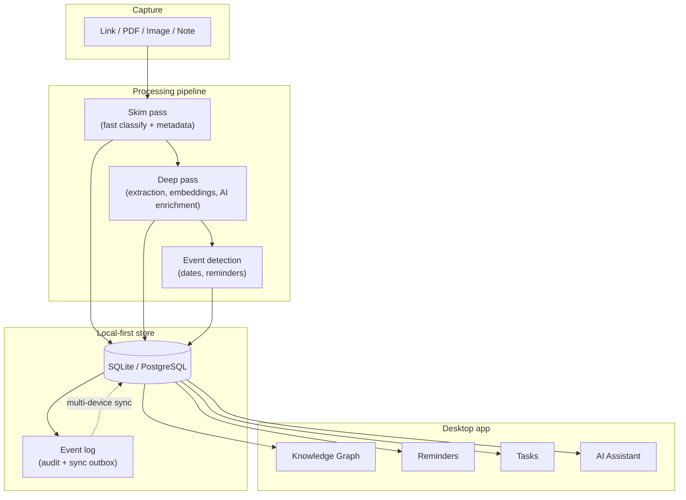

# Self Systems

A local-first personal knowledge system. Capture anything — links, PDFs, images, notes — and it gets extracted, classified, embedded, and connected into a navigable knowledge graph.

## What it does

Most tools that save things for you make *you* do the filing — tags, folders, manual sorting. Self Systems reads what you save, classifies it, and connects it to everything else you've saved, so the organizing happens on its own.

Four things it handles:

- **Memory** — every saved resource lands in a graph, linked by similarity and category, not folders.
- **Reminders** — dates and events mentioned in what you save are picked up automatically.
- **Tasks** — a to-do list that can be derived from what you've saved, not just typed in.
- **Assistant** — a chat interface over all of it: ask questions, find related resources, manage tasks.

## How it fits together

Everything runs locally by default — no account, no required API key. Cloud AI providers (OpenAI, Anthropic, Gemini) are optional and swap in behind a heuristic fallback that works offline.

## Stack

Go · React + TypeScript · SQLite / PostgreSQL · Wails desktop shell

## Status

Active development. Source is kept in a private repository — this repo is a public showcase of the project.

## License

See [LICENSE](LICENSE).
