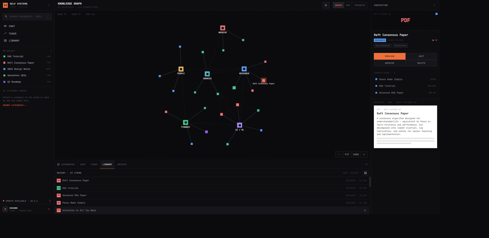

# Self Systems

A local-first personal knowledge system. Capture anything — links, PDFs, images, notes — and it gets extracted, classified, embedded, and connected into a navigable knowledge graph.

Dark-mode-first desktop app: a knowledge graph with Graph / Map / Progress views, chat-driven capture, tasks, and an inspector for resource previews, connections, and AI summaries.

## Stack

Go · React + TypeScript · SQLite / PostgreSQL · Wails desktop shell

## Status

Active development. Source is kept in a private repository — this repo is a public showcase of the project.
